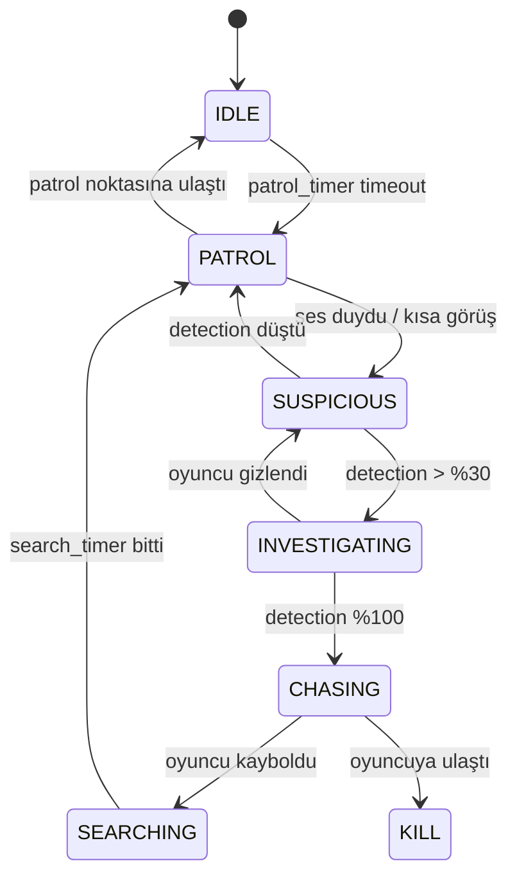

# BLACKOUT — Prototype I Geliştirme Planı (Godot 4)

> **Motor:** Godot 4.x | **Perspektif:** 2D Top-Down | **Tür:** Survival-Horror / Stealth
> **Hedef:** Playtest edilebilir tek seviyeli bir prototip oluşturmak

---

## 1. Proje Vizyonu & Prototip Kapsamı

Prototype I, BLACKOUT'un temel deneyimini test etmek için tasarlanmıştır:
- Karanlık koridorlarda **Light2D tabanlı görüş** sistemi
- **El feneri açma/kapama** ikileminin yarattığı gerilim
- **Stealth-odaklı** oynanış (kaçınma > savaş)
- **Kısıtlı kaynaklar** (pil + mermi) ile baskı
- **Atmospheric ses tasarımı** ile korku atmosferi
- Çıkış kapısına ulaşarak seviye tamamlama

> [!IMPORTANT]
> Bu prototip **tek bir seviye** içerecek. Amaç tüm mekaniklerin birlikte çalışmasını test etmek ve playtest geri bildirimi almaktır.

---

## 2. Proje Yapısı (Dosya Organizasyonu)

```
blackout/
├── project.godot
├── assets/
│   ├── sprites/
│   │   ├── player/            # Alex Vance sprite sheet
│   │   ├── enemies/           # Creature sprite/animasyonları
│   │   ├── environment/       # Duvar, kapı, raf, obje spriteları
│   │   ├── items/             # Pil, mermi, anahtar ikonları
│   │   └── ui/               # HUD elemanları
│   ├── audio/
│   │   ├── sfx/              # Ayak sesi, silah, kapı, cam kırılma
│   │   ├── ambient/          # Uğultu, damla, rüzgar, metal gıcırtı
│   │   └── music/            # Gerilim müzikleri (varsa)
│   ├── fonts/                # UI fontları
│   └── textures/
│       └── lights/           # Fener ışık gradient texture'ları
├── scenes/
│   ├── player/
│   │   └── player.tscn       # Player sahnesi
│   ├── enemies/
│   │   └── creature.tscn     # Yaratık sahnesi
│   ├── items/
│   │   ├── battery.tscn      # Pil pickup
│   │   └── ammo.tscn         # Mermi pickup
│   ├── objects/
│   │   ├── door_exit.tscn    # Çıkış kapısı
│   │   ├── hiding_spot.tscn  # Saklanma noktası
│   │   └── light_source.tscn # Ortam ışık kaynağı
│   ├── levels/
│   │   └── level_01.tscn     # Prototip seviyesi
│   ├── ui/
│   │   ├── hud.tscn          # Oyun içi HUD
│   │   ├── main_menu.tscn    # Ana menü
│   │   ├── pause_menu.tscn   # Duraklama menüsü
│   │   └── game_over.tscn    # Ölüm ekranı
│   └── main.tscn             # Ana sahne (seviye yükleyici)
├── scripts/
│   ├── player/
│   │   ├── player.gd         # Player controller
│   │   ├── flashlight.gd     # El feneri sistemi
│   │   └── weapon.gd         # Silah sistemi
│   ├── enemies/
│   │   ├── creature.gd       # Yaratık AI controller
│   │   └── enemy_states.gd   # State machine
│   ├── items/
│   │   ├── battery.gd        # Pil pickup logic
│   │   └── ammo.gd           # Mermi pickup logic
│   ├── systems/
│   │   ├── game_manager.gd   # Autoload - oyun durumu
│   │   ├── audio_manager.gd  # Autoload - ses yönetimi
│   │   └── resource_manager.gd # Kaynak takip sistemi
│   ├── ui/
│   │   ├── hud.gd            # HUD güncelleme
│   │   └── menus.gd          # Menü transitions
│   └── objects/
│       ├── door_exit.gd      # Çıkış kapısı logic
│       └── hiding_spot.gd    # Saklanma mekanizması
└── resources/
    ├── player_stats.tres      # Player başlangıç değerleri
    └── enemy_config.tres      # Düşman konfigürasyonu
```

---

## 3. Sahne Hiyerarşisi (Scene Tree)

### 3.1 Level Sahnesi (`level_01.tscn`)

```
Level01 (Node2D)
├── CanvasModulate              ← Karanlık ortam rengi (koyu mavi-siyah)
├── TileMapLayer_Ground         ← Zemin karoları (beton, karo)
├── TileMapLayer_Walls          ← Duvar karoları + LightOccluder2D
├── TileMapLayer_Decor          ← Dekorasyon (kan lekeleri, çatlaklar)
├── EnvironmentLights (Node2D)  ← Sabit ışık kaynakları
│   ├── FlickeringLight_01      ← PointLight2D + flicker script
│   └── EmergencyLight_01       ← Kırmızı acil durum ışığı
├── Player (CharacterBody2D)    ← Oyuncu instance
├── Enemies (Node2D)
│   ├── Creature_01             ← Yaratık instance
│   └── Creature_02
├── Items (Node2D)
│   ├── Battery_01
│   ├── Battery_02
│   └── Ammo_01
├── Objects (Node2D)
│   ├── HidingSpot_01           ← Masa arkası
│   ├── HidingSpot_02           ← Dolap içi
│   └── ExitDoor                ← Seviye çıkışı
├── AmbientSounds (Node2D)
│   ├── AudioStreamPlayer       ← Global ambient uğultu
│   ├── AudioStreamPlayer2D     ← Su damlası (pozisyonel)
│   └── AudioStreamPlayer2D     ← Metal gıcırtı (pozisyonel)
├── Camera2D                    ← Player'ı takip eden kamera
└── HUD (CanvasLayer)           ← UI overlay
```

### 3.2 Player Sahnesi (`player.tscn`)

```
Player (CharacterBody2D)
├── Sprite2D                    ← Karakter sprite
├── AnimationPlayer             ← Yürüme, koşma, eğilme animasyonları
├── CollisionShape2D            ← Fizik çarpışma
├── Flashlight (Node2D)
│   ├── PointLight2D            ← Fener ışığı (koni şeklinde texture)
│   └── RayCast2D               ← Işığın nereye çarptığını algılama
├── WeaponMount (Marker2D)
│   └── MuzzleFlash (PointLight2D) ← Ateş flash'ı
├── DetectionArea (Area2D)      ← Düşmanların player'ı algılaması
│   └── CollisionShape2D
├── InteractArea (Area2D)       ← Item toplama / kapı açma
│   └── CollisionShape2D
├── FootstepPlayer (AudioStreamPlayer2D) ← Ayak sesleri
├── ActionSFX (AudioStreamPlayer2D)      ← Silah, fener sesi
└── StealthIndicator (Sprite2D) ← Gizlilik durumu göstergesi (göz ikonu)
```

### 3.3 Creature Sahnesi (`creature.tscn`)

```
Creature (CharacterBody2D)
├── Sprite2D                    ← Yaratık sprite
├── AnimationPlayer             ← Idle, patrol, chase animasyonları
├── CollisionShape2D            ← Fizik çarpışma
├── DetectionZone (Area2D)      ← Algılama alanı (geniş daire)
│   └── CollisionShape2D
├── VisionCone (Area2D)         ← Görüş konisi (dar üçgen)
│   └── CollisionPolygon2D
├── RayCast2D                   ← Duvar arkasını kontrol
├── NavigationAgent2D           ← Pathfinding
├── HearingRange (Area2D)       ← Ses algılama alanı
│   └── CollisionShape2D
├── AudioStreamPlayer2D         ← Yaratık sesleri (nefes, hırıltı)
└── PointLight2D                ← Gözlerden hafif kırmızı parıltı
```

---

## 4. Temel Sistemler — Detaylı Tasarım

### 4.1 Player Sistemi

#### Hareket
| Aksiyon | Tuş | Hız | Detay |
|---------|-----|-----|-------|
| Yürüme | WASD | 120 px/s | Normal hareket, orta ses |
| Koşma | Shift + WASD | 200 px/s | Hızlı ama yüksek ses üretir |
| Eğilme (Crouch) | Ctrl | 60 px/s | Yavaş, düşük ses, collision küçülür |
| Dur | — | 0 | Sessiz, minimum algılanma |

#### Flashlight (El Feneri)
- **Toggle:** `F` tuşu ile açılıp kapanır
- **PointLight2D** kullanılır; koni şeklinde `GradientTexture2D`
- **Pil Sistemi:**
  - Başlangıç: %100 pil
  - Tükenme hızı: ~%1/saniye (yaklaşık 100 sn tam kullanım)
  - Pil %20 altında: ışık titremeye başlar (flicker efekti)
  - Pil %0: fener kapanır, kullanılamaz
  - Pil toplama: +%40 şarj
- **Görünürlük İkilemi:** Fener açıkken düşmanlar player'ı daha uzaktan ve kolay algılar

```gdscript
# Flashlight pil sistemi özeti
var battery_level: float = 100.0
var drain_rate: float = 1.0  # %/saniye
var is_on: bool = false

func _process(delta):
    if is_on:
        battery_level -= drain_rate * delta
        if battery_level <= 20.0:
            _apply_flicker()
        if battery_level <= 0.0:
            toggle_off()
```

#### Silah Sistemi (Minimum Combat)
- **Başlangıç mermisi:** 6 adet (toplam)
- **Seviye boyunca bulunabilecek ek mermi:** 3-4 adet
- **Ateş hızı:** Yavaş (bolt-action hissi, ~1.2 sn cooldown)
- **Etki:** Creature'a 2 isabet = öldürme
- **Ses:** Silah sesi TÜM düşmanları alarm durumuna geçirir
- **Muzzle flash:** Kısa süreli PointLight2D (0.1 sn)

> [!WARNING]
> Silah **son çare** olarak tasarlanmıştır. Ateş etmek diğer düşmanları çeker — bu risk açıkça oyuncuya hissettirilmelidir.

### 4.2 Aydınlatma Sistemi (Light2D)

Bu oyunun **temel mekaniği** ışık/karanlıktır.

#### Katmanlar
| Katman | Node | Amaç |
|--------|------|------|
| Ambient | `CanvasModulate` | Tüm sahneyi karanlığa çevir (`Color(0.03, 0.03, 0.08)`) |
| Fener | `PointLight2D` | Oyuncu kontrolünde koni ışık |
| Ortam Işıkları | `PointLight2D` × çeşitli | Kırmızı acil durum, titreyen floresan |
| Muzzle Flash | `PointLight2D` | Silah ateşi anlık aydınlatma |

#### Gölge Sistemi
- **LightOccluder2D** duvar tile'larına atanır (TileSet → Occlusion Layer)
- Tüm `PointLight2D` node'larında `shadow_enabled = true`
- Gölgeler gerçek zamanlı hesaplanır — koridor kesişimlerinde dramatik efekt

#### Flicker Efekti (Ortam Işıkları)
```gdscript
# Bozuk floresan lambanın titremeesi
func _process(delta):
    flicker_timer -= delta
    if flicker_timer <= 0:
        light.energy = randf_range(0.0, max_energy)
        flicker_timer = randf_range(0.02, 0.3)
```

### 4.3 Stealth & Algılama Sistemi

Oyunun en kritik sistemi — düşmanın oyuncuyu nasıl fark ettiği.

#### Algılama Faktörleri
| Faktör | Etkisi | Detay |
|--------|--------|-------|
| Fener açık | Algılama mesafesi **2x** | Işık düşmanın dikkatini çeker |
| Koşma | Ses alanı **3x** | Ayak sesleri duyulur |
| Eğilme | Algılama mesafesi **0.5x** | Düşük profil |
| Ateş etme | **Tüm düşmanlar** alarm | Ses tüm haritada duyulur |
| Karanlıkta durma | Algılama **0.2x** | Neredeyse görünmez |

#### Detection Meter (Algılama Çubuğu)
- Düşman oyuncuyu **anında fark etmez**
- Algılama çubuğu 0'dan 100'e dolulur
- Dolma hızı = mesafe × görünürlük faktörü × ışık faktörü
- **%100 olduğunda:** düşman kovalamaya geçer
- Oyuncu görüş alanından çıkarsa, çubuk yavaşça düşer
- Bu sistem oyuncuya **tepki verme şansı** tanır

```gdscript
# Algılama sistemi özeti
var detection_level: float = 0.0
const DETECTION_THRESHOLD = 100.0

func _calculate_detection(player, delta):
    var distance = global_position.distance_to(player.global_position)
    var visibility = _get_player_visibility(player)
    var rate = (1.0 / max(distance, 1.0)) * visibility * 50.0
    detection_level = clamp(detection_level + rate * delta, 0, DETECTION_THRESHOLD)
    
    if detection_level >= DETECTION_THRESHOLD:
        _transition_to_chase()
```

### 4.4 Düşman AI — State Machine



| Durum | Davranış | Hız | Ses |
|-------|----------|-----|-----|
| **IDLE** | Yerinde durur, hafif dönüş | 0 | Hafif nefes |
| **PATROL** | Waypoint'ler arası yürür | 50 px/s | Ayak sesi |
| **SUSPICIOUS** | Durur, ses/ışık yönüne bakar | 0 | Hırıltı |
| **INVESTIGATING** | Son bilinen noktaya yürür | 70 px/s | Yoğun nefes |
| **CHASING** | Oyuncuya doğru koşar | 180 px/s | Çığlık + koşma |
| **SEARCHING** | Son görülen noktada dolanır | 60 px/s | Homurdanma |
| **KILL** | Oyuncuya ulaşınca → Game Over | — | Saldırı sesi |

> [!TIP]
> Prototip I'de **1-2 yaratık** yeterlidir. AI kalitesi, düşman sayısından daha önemlidir.

### 4.5 Kaynak Yönetimi

```
GameManager (Autoload) içinde takip:
├── battery_level: float    (0-100)
├── ammo_count: int         (başlangıç: 6)
├── batteries_found: int    
├── ammo_found: int
└── is_flashlight_on: bool
```

#### Item Pickup Sistemi
- `Area2D` ile temas algılama
- `E` tuşu ile toplama (interact)
- Pickup anında **kısa ışık parlaması** + **toplama sesi**
- HUD anında güncellenir

### 4.6 Ses Tasarımı

Ses, bu oyundaki **korkunun %50'sidir**.

#### Ses Katmanları
| Katman | Tip | Örnekler |
|--------|-----|----------|
| **Ambient Loop** | `AudioStreamPlayer` | Tesis uğultusu, uzak metal gıcırtısı |
| **Positional SFX** | `AudioStreamPlayer2D` | Su damlası, kırık lamba cızırtısı |
| **Player SFX** | `AudioStreamPlayer2D` | Ayak sesleri, nefes, fener switch |
| **Enemy SFX** | `AudioStreamPlayer2D` | Hırıltı, koşma, çığlık |
| **UI SFX** | `AudioStreamPlayer` | Mermi/pil toplama, menü sesleri |

#### Audio Bus Layout
```
Master
├── Music      (ambient müzik, düşük volume)
├── SFX        (tüm efektler)
│   └── Reverb (Add Effect: Reverb – büyük boş tesis hissi)
└── Ambient    (loop sesler, EQ ile boğuk ton)
```

#### Ayak Sesi Sistemi
- Player hareketine bağlı tetikleme (AnimationPlayer method track veya timer)
- **Yürüme:** Her 0.5 sn, düşük volume
- **Koşma:** Her 0.3 sn, yüksek volume, düşman ses algılama alanını tetikler
- **Eğilme:** Her 0.8 sn, çok düşük volume
- **Pitch randomization:** `pitch_scale = randf_range(0.9, 1.1)` ile doğal his

### 4.7 HUD (Heads-Up Display)

```
HUD (CanvasLayer)
├── BatteryBar          ← Sol üst: pil ikonu + doluluk çubuğu
│   ├── BatteryIcon     ← Sprite2D (pil ikonu)
│   └── ProgressBar     ← %0-100, renk değişimi (yeşil→sarı→kırmızı)
├── AmmoCounter         ← Sol alt: mermi ikonu + sayı
│   ├── BulletIcon      ← Sprite2D
│   └── Label           ← "x 6"
├── StealthIndicator    ← Sağ üst: göz ikonu
│   └── TextureRect     ← Açık göz = görünürsün, kapalı = gizli
├── DetectionWarning    ← Ekran kenarları kırmızı vignette
│   └── ColorRect       ← Algılanma seviyesine göre opacity
├── InteractPrompt      ← Objeye yaklaşınca "[E] Topla"
│   └── Label           
└── Crosshair           ← Merkez nişangah (küçük nokta)
```

### 4.8 Saklanma (Hiding) Sistemi

- Belirli objeler "saklanma noktası" olarak işaretlenir (masa arkası, dolap, vb.)
- Player yaklaşıp `E` tuşuna basınca saklanma moduna girer
- Saklanma sırasında:
  - Player sprite'ı yarı saydam olur veya gizlenir
  - Hareket devre dışı
  - Fener otomatik kapanır
  - Düşman algılama faktörü **0.05x** (neredeyse sıfır)
  - `E` veya `Esc` ile çıkılır
- Düşman saklanma noktasının **yanından geçerse** gerilim doruk noktasına ulaşır

---

## 5. Level Tasarımı — Prototip Seviyesi

### 5.1 Harita Düzeni

```
┌────────────────────────────────────────────────────────┐
│  BAŞLANGIÇ                                             │
│  [SPAWN]──→ Koridor A ──→ Lab Odası ──→ Koridor B     │
│                              │                  │      │
│                          [Yaratık1]        [Pil_01]    │
│                              │                  │      │
│              ┌───────────────┘                  │      │
│              ▼                                  │      │
│        Depo Odası ←──── Koridor C ──────────────┘      │
│        [Saklanma]         [Yaratık2]                   │
│        [Mermi_01]              │                       │
│              │                 ▼                       │
│              └────→ Ana Salon ──→ Koridor D ──→ [ÇIKIŞ]│
│                    [Pil_02]        [Mermi_02]          │
│                    [Ortam Işığı]                       │
└────────────────────────────────────────────────────────┘
```

### 5.2 Level Akışı (Pacing)

| Bölüm | Atmosfer | Tehdit | Kaynak | Amaç |
|--------|----------|--------|--------|------|
| Koridor A | Sessiz, öğretici | Yok | — | Hareketi öğren, ortama alış |
| Lab Odası | Gerilim artışı | Yaratık 1 (patrol) | Pil | İlk stealth karşılaşma |
| Koridor B | Kısa rahatlama | Yok | Pil 01 | Ödül ve nefes alma |
| Depo Odası | Güvenli bölge hissi | Yok | Mermi, saklanma | Kaynak toplama |
| Koridor C | Tehlike | Yaratık 2 (Aktif) | — | Zorluk artışı |
| Ana Salon | Açık alan, savunmasız | Ortam gerilimi | Pil 02 | Açık alan stresi |
| Koridor D | Son sprint | Zaman baskısı hissi | Mermi 02 | Çıkışa ulaş |

### 5.3 TileMap Konfigürasyonu

- **TileSet:** 16×16 veya 32×32 pixel boyutunda tile setleri
- **Tile Katmanları:**
  - `Ground` → Beton zemin, karo zemin, metal ızgara
  - `Walls` → Beton duvarlar + **Occlusion Layer** (ışık engelleme)
  - `Decor` → Kan lekeleri, çatlaklar, biyotehlike işaretleri, devrilmiş raflar
- **Terrain Sets (Autotile):** Duvar/zemin geçişleri için otomatik bağlantı

---

## 6. Collision Layer Planı

| Layer | İsim | Kullanan |
|-------|------|----------|
| 1 | Walls | TileMap duvarları, kapılar |
| 2 | Player | Player CharacterBody2D |
| 3 | Enemies | Creature CharacterBody2D |
| 4 | PlayerDetection | Düşman algılama alanları |
| 5 | Items | Pickup objeler (pil, mermi) |
| 6 | Interaction | Kapılar, saklanma noktaları |
| 7 | PlayerNoise | Oyuncu ses alanı (koşma algılama) |

---

## 7. Autoload (Singleton) Managers

### 7.1 `GameManager` (Autoload)
```gdscript
# Oyunun global durumunu yönetir
extends Node

signal battery_changed(value)
signal ammo_changed(value)
signal player_detected
signal player_died
signal level_completed

var battery_level: float = 100.0
var ammo_count: int = 6
var is_flashlight_on: bool = false
var is_game_paused: bool = false
var current_detection: float = 0.0
```

### 7.2 `AudioManager` (Autoload)
```gdscript
# Ses efektlerini merkezi olarak yönetir
extends Node

var ambient_player: AudioStreamPlayer
var sfx_pool: Array[AudioStreamPlayer]

func play_sfx(sound_name: String, position: Vector2 = Vector2.ZERO):
    # Pozisyonel veya global ses çalma
    pass

func set_tension_level(level: float):
    # Gerilim seviyesine göre ambient ses değiştirme
    pass
```

---

## 8. Sprint Planı (Geliştirme Aşamaları)

### Sprint 1: Temel Altyapı (Gün 1-2)
- [ ] Godot 4 projesi oluştur, dosya yapısını kur
- [ ] Placeholder sprite'ları oluştur (basit geometrik şekiller)
- [ ] Player sahnesi: hareket (WASD), koşma (Shift), eğilme (Ctrl)
- [ ] Kamera takip sistemi (Camera2D, smooth follow)
- [ ] Temel TileMap: basit koridor düzeni
- [ ] CanvasModulate ile karanlık ortam
- [ ] Collision layer konfigürasyonu
- [ ] GameManager autoload kurulumu

### Sprint 2: Işık ve Fener Sistemi (Gün 3-4)
- [ ] Player'a PointLight2D fener ekle (koni texture)
- [ ] Fener açma/kapama (F tuşu) + pil azalması
- [ ] Pil düşükken flicker efekti
- [ ] Duvar tile'larına LightOccluder2D ekle (gölge sistemi)
- [ ] Ortam ışıkları: titreyen floresan, acil durum ışığı
- [ ] Pil pickup objesi + toplama mekaniği

### Sprint 3: Stealth & Düşman AI (Gün 5-7)
- [ ] Creature sahnesi: sprite + collision + hareket
- [ ] State Machine: IDLE → PATROL → SUSPICIOUS → CHASING → SEARCHING
- [ ] Patrol sistemi: waypoint arası yürüme
- [ ] Görüş konisi (Area2D + CollisionPolygon2D)
- [ ] Line-of-sight kontrolü (RayCast2D)
- [ ] Detection meter: kademeli algılama
- [ ] Fener açıkken algılama artışı
- [ ] Ses algılama: koşma ve ateş etme sesi
- [ ] NavigationAgent2D ile pathfinding
- [ ] Oyuncuya ulaşınca → Game Over

### Sprint 4: Silah & Saklanma (Gün 8-9)
- [ ] Silah sistemi: nişan alma (fare), ateş etme (sol tık)
- [ ] Mermi sayısı takibi + mermi pickup
- [ ] Muzzle flash (anlık PointLight2D)
- [ ] Ateş sesi → tüm düşmanları alarma geçirme
- [ ] Creature hasar sistemi (2 isabet = ölüm)
- [ ] Saklanma noktaları: masa, dolap
- [ ] Saklanma moduna giriş/çıkış (E tuşu)
- [ ] Saklanma sırasında düşman geçiş animasyonu

### Sprint 5: Ses Tasarımı (Gün 10-11)
- [ ] Audio Bus Layout kurulumu (Master, SFX, Ambient, Music)
- [ ] Ambient loop: tesis uğultusu, uzak metalik sesler
- [ ] Pozisyonel sesler: su damlası, kırık lamba
- [ ] Player ayak sesleri (yürüme/koşma/eğilme farklı)
- [ ] Pitch randomization
- [ ] Fener açma/kapama sesi (klik)
- [ ] Silah ateşi sesi
- [ ] Creature sesleri: nefes, hırıltı, çığlık (duruma göre)
- [ ] Pil/mermi toplama sesi
- [ ] Reverb efekti (büyük boş koridor hissi)

### Sprint 6: HUD & Menüler (Gün 12-13)
- [ ] HUD: pil çubuğu, mermi sayacı, stealth göstergesi
- [ ] Algılanma uyarısı (ekran kenarı kırmızı vignette)
- [ ] Etkileşim prompt'u ([E] Topla / [E] Saklan)
- [ ] Main Menu: BLACKOUT başlığı, başla butonu
- [ ] Pause Menu: devam, yeniden başla, çık
- [ ] Game Over ekranı: ölüm animasyonu + yeniden başla
- [ ] Level tamamlama ekranı

### Sprint 7: Level Tasarımı & Polish (Gün 14-16)
- [ ] Tam prototip seviyesini TileMap ile oluştur
- [ ] Ortam detayları: devrilmiş raflar, kırık cam, biyotehlike işaretleri
- [ ] Düşman yerleşimi ve patrol rotaları
- [ ] Item yerleşimi (pil, mermi)
- [ ] Saklanma noktaları yerleşimi
- [ ] Çıkış kapısı mekanizması
- [ ] Pacing testi: sessiz → gerilim → tehlike → rahatlama döngüsü
- [ ] Ekran sarsıntısı (screen shake) efektleri
- [ ] Post-processing: hafif vignette, CRT scanline (opsiyonel)

---

## 9. Kontrol Şeması

| Tuş | Aksiyon |
|-----|---------|
| `W/A/S/D` | Hareket (8 yön) |
| `Shift` | Koşma (basılı tut) |
| `Ctrl` | Eğilme/Crouch (toggle) |
| `F` | Fener aç/kapa (toggle) |
| `E` | Etkileşim (topla, saklan, kapı) |
| `Sol Tık` | Ateş et |
| `Fare` | Nişan yönü |
| `Esc` | Duraklama menüsü |

---

## 10. Sprite & Asset Planı

Prototip I için **placeholder** sprite'lar yeterlidir. Basit geometrik şekiller + renkler:

| Asset | Placeholder Tasviri | Boyut |
|-------|---------------------|-------|
| Player | Yeşil dikdörtgen + yön üçgeni | 16×16 / 32×32 |
| Creature | Kırmızı daire + kırmızı parıltı | 16×16 / 32×32 |
| Duvar Tile | Koyu gri kare | 16×16 / 32×32 |
| Zemin Tile | Açık gri kare | 16×16 / 32×32 |
| Pil | Sarı küçük dikdörtgen | 8×8 |
| Mermi | Turuncu küçük daire | 8×8 |
| Çıkış Kapısı | Mavi dikdörtgen | 32×16 |
| Fener Işık | Radyal gradient PNG | 256×256 |
| Saklanma Noktası | Kahverengi dikdörtgen (masa) | 32×16 |

> [!TIP]
> Placeholder asset'ler Godot editöründe doğrudan `Sprite2D` + `ColorRect` kullanılarak veya basit PNG'ler çizerek hızla yapılabilir. Prototip aşamasında **mekanik** görsellerden daha önemlidir.

---

## 11.Doğrulama Planı (Verification)

### Playtest Kontrol Listesi

#### Temel Mekanikler ✓
- [ ] Player 8 yönde hareket edebilir
- [ ] Koşma ve eğilme hız farkları hissedilir
- [ ] Fener açılır/kapanır, pil azalır
- [ ] Pil %20 altında flicker olur
- [ ] Pil bittikten sonra fener çalışmaz
- [ ] Pil toplanabilir, HUD güncellenir
- [ ] Silah ateş eder, mermi azalır
- [ ] Mermisiz ateş edilemez

#### Stealth & AI ✓
- [ ] Düşman patrol rotasında yürür
- [ ] Düşman fener ışığıyla oyuncuyu daha hızlı algılar
- [ ] Koşma sesi düşmanı harekete geçirir
- [ ] Silah sesi tüm düşmanları alarma geçirir
- [ ] Karanlıkta eğilmek neredeyse görünmez yapar
- [ ] Saklanma noktası düşman tespitini engeller
- [ ] Düşman oyuncuya ulaşınca Game Over tetiklenir
- [ ] Düşman oyuncuyu kaybedince arama moduna geçer

#### Atmosfer ✓
- [ ] Ortam yeterince karanlık, korku hissi verir
- [ ] Gölgeler duvarlardan geçmez (occlusion çalışır)
- [ ] Ambient sesler sürekli çalar
- [ ] Ayak sesleri hareket tipiyle değişir
- [ ] Genel pacing: sessizlik → gerilim → tehlike döngüsü

#### Seviye Tamamlama ✓
- [ ] Çıkış kapısına ulaşılabilir
- [ ] Çıkışta seviye tamamlama ekranı gösterilir
- [ ] Yeniden başlatma çalışır

### Manuel Test Prosedürü
1. Oyunu başlat → karanlık koridor kontrolü
2. WASD ile hareket → hız ve animasyon kontrolü
3. F ile fener → ışık, gölge, pil azalması kontrolü
4. Yaratık patrol rotasında → stealth yaklaşım dene
5. Feneri yaratığa yönelt → algılama artışı kontrolü
6. Saklanma noktasına gir → yaratık geçişi kontrolü
7. Ateş et → ses alarm mekanizması kontrolü
8. Çıkış kapısına ulaş → level complete kontrolü
9. Game Over → yeniden başlama kontrolü

---

## 12. Bilinen Riskler & Kararlar

> [!WARNING]
> ### Performans Riski
> Çok sayıda `PointLight2D` + `shadow_enabled` performansı etkileyebilir. Prototipte maksimum **5-6 aktif ışık kaynağı** ile sınırlı tutulmalı.

> [!IMPORTANT]
> ### Karar: Tile Boyutu
> **16×16** vs **32×32** tile boyutu proje başında kesinleştirilmelidir. 32×32 piksel daha detaylı placeholder'lar sağlar ve daha iyi Light2D kalitesi verir. **Önerimiz: 32×32**.

> [!NOTE]
> ### Ses Dosyaları
> Prototip için ses dosyaları internetten ücretsiz kaynaklar (freesound.org, Kenney.nl) veya Godot'un temel ses üretim araçlarıyla sağlanabilir. Ses, atmosferin büyük bölümünü oluşturduğundan, **placeholder bile olsa ses eklenmesi kritiktir**.

---

## Özet

Bu plan, BLACKOUT Prototype I'i Godot 4'te **2D top-down** perspektifle geliştirmek için **7 sprint** (yaklaşık 16 iş günü) kapsamaktadır. Odak noktaları:

1. **Işık = Mekaniğin Kalbi** — Light2D + LightOccluder2D + CanvasModulate
2. **Stealth = Oynanışın Kalbi** — Detection meter + görüş konisi + ses algılama
3. **Kıtlık = Gerilimin Kalbi** — Sınırlı pil + sınırlı mermi
4. **Ses = Atmosferin Kalbi** — Ambient loop + pozisyonel SFX + reverb

Playtest'in amacı: Bu dört unsurun birlikte çalışarak **"güçsüz bir insan olarak hayatta kalma"** hissini verip vermediğini test etmek.
